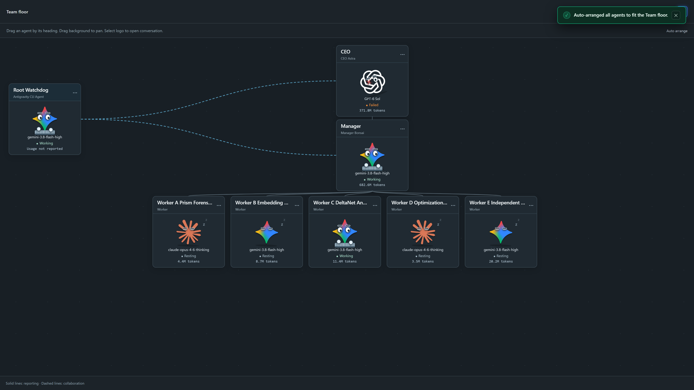

# Agentic Team MCP — Persistent Autonomous Multi-Agent Operating System

[](LICENSE)
[](https://www.python.org/)
[](https://modelcontextprotocol.io)
[](#)
[](#)
[](https://t.me/ufljarvisbot)


*Live full-screen Web Studio canvas on Project `Bonsai_Sauce_Qwen3.5-2B` showing the active 5-tier hierarchy: Root Watchdog sentinel, CEO Astra, Manager Bonsai, and the 5 specialized research workers (Workers A–E) with live SVG collaboration links and token telemetry. (See animated GIF: [`assets/web_studio_preview.gif`](assets/web_studio_preview.gif))*

> **Agentic Team MCP** is an enterprise-grade, local-first multi-agent operating system and [Model Context Protocol (MCP)](https://modelcontextprotocol.io) platform. It establishes a resilient, persistent hierarchical workforce (**Root Watchdog → CEO Strategy → Operational Managers → Specialist Workers → Human Owner**) that unifies native developer CLI coding environments (Claude Code, Gemini Antigravity, OpenAI Codex) with direct high-throughput API engines (DeepSeek, Z.ai/GLM, Google Gemini, OpenAI, Experiential Labs, Groq) and cloud GPU training infrastructure.

---

## 🏛️ Executive Summary & Architectural Overview

The **Agentic Team MCP** ecosystem evolved from a single-process command runner into a distributed, autonomous multi-agent operating system bridging local developer workflows, cloud GPU distillation pipelines, browser dashboards, and encrypted mobile Telegram communication.

```
                             +-----------------------------------+
                             |       HUMAN OWNER (@zwyci)        |
                             +-----------------+-----------------+
                                               |
                     +-------------------------+-------------------------+
                     | Telegram (@ufljarvisbot)                          | Antigravity Web Studio
                     | [Mobile Telegram Bridge]                          | [http://127.0.0.1:8765]
                     +-------------------------+-------------------------+
                                               |
                               +---------------+---------------+
                               |         ROOT WATCHDOG         |
                               | (Master Sentinel & Director)  |
                               +---------------+---------------+
                                               |
                               +---------------+---------------+
                               |           CEO ASTRA           |
                               | (Strategic Critic & Spawner)  |
                               +-------+---------------+-------+
                                       |               |
             +-------------------------+               +-------------------------+
             |                                                                   |
+------------+------------+                                         +------------+------------+
|     CAMPAIGN_MANAGER    |                                         |     MANAGER_BONSAI      |
| (Project: Job searching)|                                         | (Project: Qwen3.5-2B)   |
+------------+------------+                                         +------------+------------+
             |                                                                   |
     [Worker Fleet]                                                      [Worker Fleet]
 (Global, EMEA, Local)                                               (Prism, DeltaNet, RunPod)
```

### Core Architectural Pillars
1. **Strict 5-Tier Command Chain**: `Workers → Manager → CEO → Watchdog → Human Owner` prevents runaway token loops, protects executive quotas, and enforces structured handoffs.
2. **Multi-Account Google Auth Pool (`core/auth_pool.py`)**: Isolated directory profiles, Windows Credential Vault sandboxing, sticky KV-cache affinity, and automatic 429 quota failover for Gemini 3.8 Flash High and Claude 4.6 Opus.
3. **Multi-Harness Execution Subsystem (`harness/`)**: Modular adapters for subprocess CLIs (`antigravity`, `codex`, `claude_code`) and high-throughput streaming (`direct_api` for DeepSeek-V3/R1, GLM-5, Experiential Labs `xpl`, Groq).
4. **Autonomous Telegram Bridge (`core/telegram_*`)**: Mobile interface (`@ufljarvisbot`) featuring cryptographic sender whitelisting, typing simulation, voice note STT transcription, vision ingestion, and automated `[DISPATCH]` & `[SEND_FILE]` triggers.
5. **Interactive Web Studio (`web/`)**: Real-time WebSocket state streaming, full-screen canvas layout, live SVG message vectors, and granular token/pricing telemetry.
6. **Cloud Compute & Training Orchestration**: Headless RunPod GPU deployment, unquantized teacher-student distillation pipelines, fail-closed zero-burn teardowns, and physical Q2_0 quantization validation.
7. **Production Resiliency**: Starlette path-traversal middleware patches, Windows socket lifecycle management, and transactional SQLite event sourcing.

---

## 🔬 Subsystem Deep Dives

### 1. Google Multi-Account Auth Pool (`core/auth_pool.py`)
Agents running on the Google Account Pool (`antigravity` harness) rely on `gemini-3.8-flash-high` and `claude-opus-4-6-thinking`.
* **Per-Account Directory Isolation**: Each Google account receives a dedicated directory (`auth/google/account_XX/`) with its own `.gemini/` configuration, sub-settings, and credential vaults. `USERPROFILE`, `HOME`, and `ANTIGRAVITY_APP_DATA_DIR` are scoped exclusively to that folder.
* **Keyring Swap & Vault Capture Engine**: When initiating authentication for a new slot, the system backs up existing vault credentials into `credential.dat`, wipes the active Windows Keyring entry to prevent silent auto-login, and launches an isolated PowerShell terminal for OAuth completion.
* **Sticky Affinity & Rate-Limit Concurrency Gates**: Each agent is granted slot affinity (`forced_auth_slot_id`) so ongoing conversations continue hitting the same account to maximize KV-cache reuse. Concurrency limiters (`max_concurrent = 4` per account) prevent socket saturation.
* **Automated Quota Failover**: Detection of `429 Rate Limit` or quota saturation immediately transitions the slot to `quota-blocked` with exponential backoff, routing pending tasks to the next healthiest slot without destroying conversation context.

### 2. Multi-Harness Subsystem (`harness/` & `core/providers.py`)
Decouples high-level agent logic from physical model execution:
* **`antigravity` (Antigravity CLI Runner)**: Primary driver for Google Account Pool (`gemini-3.8-flash-high`, `claude-opus-4-6-thinking`).
* **`codex` (OpenAI Codex CLI Runner)**: Integrates OpenAI's developer CLI for frontier models (`gpt-6-sol`, `gpt-6-luna`, `gpt-4o`).
* **`claude_code` (Claude Code CLI Runner)**: Executes Anthropic's native terminal agent with full tool harness capabilities.
* **`direct_api` (High-Throughput HTTP Client)**: Direct SSE streaming client for third-party API providers:
  * **Experiential Labs (`xpl`)**: Special integration supporting `gpt-6-sol` and `claude-opus-5.5` using dedicated API keys.
  * **DeepSeek**: DeepSeek Chat / Reasoner endpoints.
  * **Zhipu AI (GLM)**: GLM-4 / GLM-5.3 integration.
  * **Groq & Together**: Ultra-low-latency open-weights inference.
* **Context Preservation & Session Handoffs**: When an agent is reconfigured from one harness or model to another, the engine serializes the conversation transcript into `manager/.handoffs/<hash>.json`, preventing cognitive amnesia during architectural transitions.

### 3. Root Watchdog & Autonomous Telegram Bridge (`core/telegram_*`)
Root Watchdog functions as the autonomous Chief of Staff connecting the Human Owner to the platform via Telegram (`@ufljarvisbot`).
* **Cryptographic Whitelisting**: Restricts all control strictly to **Abdulaziz Komilov (@zwyci / Chat ID: `5644286697`)**. Unauthorized Telegram IDs are silently dropped.
* **Typing Indicator Simulation**: During multi-step tool calls or deep reasoning, an asynchronous loop triggers Telegram's `send_chat_action(action='typing')` every 4.5 seconds.
* **Autonomous Tool Directives**:
  * `[DISPATCH: <AGENT>] <instruction>`: Watchdog autonomously wakes sleeping managers or enqueues tasks.
  * `[SEND_FILE: <path>]`: Automatically uploads generated artifacts, reports, or logs as physical files directly to Telegram.
* **Multimodal Ingestion Pipeline (`core/multimodal.py`)**: Audio voice messages are downloaded and transcribed via speech-to-text; images/documents are ingested and passed as native vision tokens.

### 4. Interactive Web Studio (`web/`)
The Web Studio (`http://127.0.0.1:8765`) serves as the operational cockpit:
* **Topological Canvas & Full-Screen Mode**: Interactive nodes linked by SVG vectors representing hierarchy. Dedicated full-screen toggle (`#btn-fullscreen-floor` / `floor-fullscreen`) provides distraction-free monitoring.
* **Real-Time Communication Flow**: Over a `/ws` WebSocket endpoint, active tool calls and messages animate traveling pulses along SVG vectors connecting sender and recipient nodes.
* **Telemetry & Pricing Metrics (`telemetry.js`)**: Tracks execution stats across all projects: `input_tokens`, `output_tokens`, `cache_read_tokens`, and turnaround latencies with real-time cost modeling.
* **Starlette Wildcard Route Crash Fix**: Wrapped route boundary middleware in `web/app.py` catching `OSError: [WinError 123]` on invalid path characters, returning clean HTTP 404 instead of process crashes.

### 5. Cloud GPU Distillation & Physical Quantization (SDE43)
In project `Bonsai_Sauce_Qwen3.5-2B`, the platform conducted SDE43 Phase 1 Strategy B: quantizing Qwen3.5-2B into a strict ternary representation with physical Q2_0 serialization:
* **Uncapped RunPod Headless Deployment**: Pod `51g9hl8u5ycurw` (NVIDIA L40 48GB VRAM @ $0.7180/hr) ran continuous distillation across **5,000 steps** (87.2 minutes), streaming BF16 activations into a Straight-Through Estimator (STE) student.
* **Zero-Billing Teardown**: Upon upload failure/completion, verified via RunPod GraphQL API that `myself.pods` returned empty (`[]`), guaranteeing zero compute or storage leakage. Realized spend was **$1.2669 USD** (78.1% under budget).
* **Offline CPU Verification ($0.00 Cloud Spend)**:
  * Unquantized Teacher Baseline: `3.4092 NLL` (PPL 30.24)
  * Step 0 Analytical Rounding: `14.1617 NLL` (PPL 1,413,673)
  * Step 4,500 Physical Artifact: **`5.3997 NLL`** (PPL **`221.34`**)
  * **Result**: Recovered **`81.49%`** of the quantization collapse, closing the teacher gap to `+1.9905 nats`.

---

## 🗂️ Master Component Inventory

| File Path | Primary Function & Architectural Role | Upgrades Implemented |
|---|---|---|
| `core/auth_pool.py` | Google Multi-Account Auth Manager | Isolated directories, Keyring vault swap/capture, sticky agent affinity, max-concurrent gates. |
| `core/config.py` | System Settings & CLI Path Resolver | Provider settings, XPL keys, Antigravity/Codex auto-detection, and key redaction. |
| `core/credential_store.py` | Keyring / Windows Vault Interface | Low-level credential read/write/delete methods for isolated terminal logins. |
| `core/multimodal.py` | Telegram Multimodal Handler | Audio speech-to-text processing, image/video attachment downloading, and media token passing. |
| `core/prompts.py` | Global System Prompts & Hard Rules | 5-tier escalation chain, Google pool mandate, CEO role protection, and model permission gates. |
| `core/providers.py` | Provider Client Adapters | Experiential Labs adapter (`xpl`), OpenAI/Codex model routing, GLM streaming, and token normalizers. |
| `core/service.py` | Daemon Lifecycle & Lockfiles | `ensure_engine()`, process startup file locking (`msvcrt`), descriptor validation, and health checks. |
| `core/telegram_bridge.py` | Telegram Bot Supervisor | Chat ID whitelisting (`5644286697`), typing simulation, `[DISPATCH]` and `[SEND_FILE]` execution. |
| `core/watchdog_brain.py` | Watchdog Decision Engine | ReAct audit loop, team tree inspection, and autonomous report generation. |
| `engine/actions.py` | Team Action Dispatcher | Handlers for `spawn_worker`, `reconfigure_agent`, `send_team_message`, `escalate_to_ceo`, `terminate_worker`. |
| `engine/loop_monitor.py` | Anti-Spinning Monitor | Inactivity timeout detection, runaway token loops, and stall mitigations. |
| `engine/message_router.py` | Pub/Sub Event Bus | Asynchronous event broadcasting, WebSocket subscriptions, and cross-project routing. |
| `engine/orchestrator.py` | Central Autonomous Runtime | Multi-agent execution loop, heartbeat management, harness supervision, SQLite state persistence. |
| `engine/store.py` | SQLite State Storage | `team.sqlite3` persistence, event streaming ledger, and transaction rollback guards. |
| `harness/cli_runner.py` | Subprocess CLI Interface | Spawns `agy`, `codex`, and `claude` with environment isolation and stdio streaming. |
| `harness/direct_api.py` | Direct Provider API Client | High-performance HTTP client for direct API keys with streaming support. |
| `mcp_server/server.py` | FastMCP Stdio Protocol Bridge | Exposes team tools (`list_projects`, `get_team_tree`, `spawn_worker`, etc.) over standard MCP. |
| `web/app.py` | Web Studio API & WebSocket Server | REST endpoints for Auth Pool, static file serving, Starlette wildcard crash patch, `/ws` telemetry. |
| `web/static/studio.js` | Web Studio Frontend Logic | Topological canvas, SVG link drawing, full-screen floor mode, live message animations, Auth Pool UI. |
| `web/static/telemetry.js` | Metrics & Financial Visualizer | Token metering, cache ratio calculations, and provider burn tracking. |
| `main.py` | Application Entrypoint | CLI parsing (`--serve`, `--mcp`, `--console`), Windows socket reuse handling, descriptor management. |
| `AGENTS.md` | Master Sentinel Manifesto | Core operating doctrine, Telegram formatting rules, escalation hierarchy, autonomous directives spec. |

---

## ⚡ 2-Minute Quickstart Guide

### Step 1: Installation & Setup

#### Windows (One-Click Setup)
```powershell
git clone https://github.com/menma4ever/agentic-team-mcp.git
cd agentic-team-mcp
.\Setup.ps1
```

#### Manual Virtual Environment Setup (Cross-Platform)
```bash
git clone https://github.com/menma4ever/agentic-team-mcp.git
cd agentic-team-mcp

python -m venv .venv
# Windows:
.venv\Scripts\Activate.ps1
# Linux / macOS:
source .venv/bin/activate

pip install -r requirements.txt
```

### Step 2: Configuration
```bash
cp settings.example.json settings.json
```
Edit `settings.json` with your preferred API keys or CLI toggles:
```json
{
  "api_keys": {
    "deepseek": "sk-your-deepseek-key",
    "zai": "your-zai-api-key",
    "gemini": "your-gemini-api-key",
    "openai": "",
    "anthropic": ""
  },
  "cli_auth_enabled": {
    "claude": true,
    "agy": true,
    "codex": false
  }
}
```

### Step 3: Launching Web Studio & Orchestrator
```cmd
Launch.cmd
```
Or manually:
```bash
python main.py
```
Opens browser at `http://127.0.0.1:8765/#token=<token>`.

### Step 4: Connecting via Model Context Protocol (MCP)

#### Claude Desktop Configuration (`claude_desktop_config.json`)
```json
{
  "mcpServers": {
    "agentic-team": {
      "command": "C:\\path\\to\\agentic-team-mcp\\.venv\\Scripts\\python.exe",
      "args": [
        "C:\\path\\to\\agentic-team-mcp\\main.py",
        "--mcp"
      ]
    }
  }
}
```

#### Cursor IDE Configuration (`.cursor/mcp.json`)
```json
{
  "mcpServers": {
    "agentic-team": {
      "command": "C:\\path\\to\\agentic-team-mcp\\.venv\\Scripts\\python.exe",
      "args": [
        "C:\\path\\to\\agentic-team-mcp\\main.py",
        "--mcp"
      ]
    }
  }
}
```

---

## 🛠️ Available MCP Tools Reference

| Tool Name | Scope | Description |
| :--- | :--- | :--- |
| `list_projects` | Workspace | Enumerate all active and completed multi-agent team projects. |
| `create_project` | Workspace | Initialize a new project and provision the root CEO agent. |
| `get_team_tree` | Inspection | Retrieve the full hierarchical agent tree with live statuses and telemetry. |
| `get_agent_activity` | Owner | Inspect real-time execution event logs and command outputs. |
| `get_agent_conversation` | Owner | Read authenticated conversation messages and handoff records. |
| `create_manager` | Orchestration | Dispatch an operational Manager under the CEO for milestone management. |
| `spawn_worker` | Orchestration | Provision specialized workers with assigned task descriptions and harnesses. |
| `send_team_message` | Messaging | Dispatch targeted, authenticated peer or hierarchy messages. |
| `reconfigure_agent` | Management | Dynamically switch models or harnesses with saved state handoff. |
| `read_worker_status` | Status | Query worker lifecycle stage, current activity, and recent outputs. |
| `terminate_worker` | Cleanup | Safely decommission worker processes and clean up or archive workspaces. |
| `escalate_to_ceo` | Hierarchy | Bubble up blocking architectural or security issues to the CEO. |
| `team_action` | Action Bus | Unified action channel (`read_file`, `write_file`, `update_status`, `report_result`, etc.). |

---

## 🤝 Community & Support

- **Telegram:** [@zwyci](https://t.me/zwyci) / Bot: [@ufljarvisbot](https://t.me/ufljarvisbot)
- **Discord:** `77terminator77`
- **GitHub Issues:** [menma4ever/agentic-team-mcp/issues](https://github.com/menma4ever/agentic-team-mcp/issues)
- **GitHub Discussions:** [menma4ever/agentic-team-mcp/discussions](https://github.com/menma4ever/agentic-team-mcp/discussions)

---

## 📄 License

Distributed under the **MIT License**. See [`LICENSE`](LICENSE) for complete terms.
