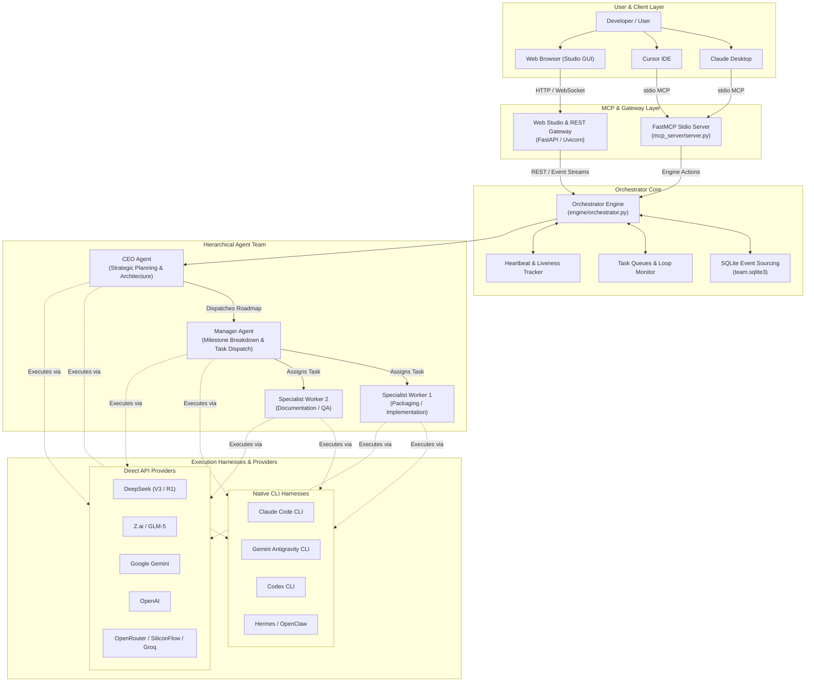

# Agentic Team MCP — Persistent Multi-Agent Orchestration for Model Context Protocol

[](LICENSE)
[](https://www.python.org/)
[](https://modelcontextprotocol.io)
[](#)
[](#)

> **Agentic Team MCP** is an enterprise-grade, local-first multi-agent orchestration platform designed around the [Model Context Protocol (MCP)](https://modelcontextprotocol.io). It establishes a persistent, hierarchical agent workforce (CEO Strategy → Manager Execution → Specialist Workers) that bridges native CLI coding environments (Claude Code, Gemini Antigravity, Codex) with unified direct API providers (DeepSeek, Z.ai/GLM, Google Gemini, OpenAI, and OpenRouter).

---

## Author's Note

> **Abdulaziz Komilov (@menma4ever)**, student researcher in local model fine-tuning and quantization, building persistent, cost-effective multi-agent teams across native CLIs (Claude Code, Gemini Antigravity, Codex) and Model Context Protocol.
> 
> Modern agent frameworks often suffer from three fatal flaws: fragile ephemeral execution contexts, proprietary cloud lock-in, and ballooning API token costs. **Agentic Team MCP** was engineered to solve these problems by coupling **persistent SQLite event sourcing** with **native CLI adapters** (leveraging existing subscription authorizations like Claude Code, Gemini Antigravity, and Codex CLI) alongside high-efficiency open-weights models (DeepSeek-V3/R1 and GLM-5). The result is an autonomous, self-healing team architecture capable of executing complex engineering milestones locally, deterministically, and cost-effectively.

---

## Visual Architecture



---

## Core Features Matrix

| Feature | Agentic Team MCP | Traditional Multi-Agent Frameworks | Standard MCP Servers |
| :--- | :--- | :--- | :--- |
| **Persistence Model** | **Resilient SQLite Event Sourcing** (resumes after restart/crash) | In-memory or ephemeral sessions | Ephemeral (lifetime of stdio pipe) |
| **Team Hierarchy** | **Strict 3-Tier** (CEO → Manager → Specialists) | Flat peer-to-peer or unstructured swarm | Single-agent tool provider |
| **Execution Harness** | **Dual Harness** (Native CLI Subprocesses + Direct API) | API-only (HTTP calls) | External tool execution only |
| **Cost Optimization** | **Subscribed CLI Auth Pools** (Claude Code, Antigravity, Codex) | Per-token commercial billing only | Host application pays per call |
| **Local-First Security** | **Air-gapped local storage**, zero telemetry, auto key-redaction | Cloud dashboard telemetry & logs | Depends on client implementation |
| **Real-time Web Studio** | **Full visual canvas**, live terminal streams, process monitors | Static CLI output or paid SaaS dashboard | None (headless) |
| **Tool Protocol** | **Full Model Context Protocol (MCP)** specification support | Custom proprietary tool schemes | MCP Standard |

### Highlights

1. **Autonomous Hierarchical Task Decomposition**
   - The **CEO** defines strategy, breaks roadmaps into phases, and delegates to the **Manager**.
   - The **Manager** spawns and supervises dedicated **Specialist Workers** (e.g., Packaging Specialist, Documentation Specialist, Test Engineer).
   - Workers report real results with artifact paths, automatically waking the supervisor upon completion.

2. **Multi-Harness Runtime Execution**
   - Seamlessly mix and match execution environments: run high-level planning on **Gemini Antigravity** or **Claude Code**, run heavy code generation on **Codex CLI**, and run background bulk analysis on **DeepSeek-V3** or **Z.ai GLM-5**.
   - Built-in token and credential pool management rotation for seamless multi-account load balancing.

3. **Resilient SQLite Event Sourcing & Session Persistence**
   - Every message, status change, tool execution, and artifact generation is immutably recorded in `team.sqlite3`.
   - Complete machine restarts or process crashes are instantly recoverable without loss of agent state or conversation context.

4. **Real-time Web Studio GUI**
   - Interactive visual agent graph with live status indicators (`idle`, `working`, `queued`, `blocked`).
   - Integrated terminal monitors streaming subprocess stdout/stderr in real time.
   - Comprehensive telemetry dashboards for tracking turn count, token consumption, and response times.

5. **Granular Security Boundary**
   - Strict workspace sandboxing: each specialist worker operates within its designated project directory (`workers/<name>/`).
   - Automatic regex-based redaction of all sensitive API keys and tokens across console outputs and log files.
   - Separate scoped authentication tokens for agent subprocesses versus the owner dashboard.

---

## 2-Minute Quickstart Guide

### Prerequisites
- **Python 3.11+** installed and available on your system `PATH`.
- **Git** installed.
- *(Optional)* Installed CLI tools: `claude` ([Claude Code](https://docs.anthropic.com/en/docs/agents-and-tools/claude-code/overview)), `agy` ([Antigravity CLI](https://github.com/google-gemini)), or `codex` ([OpenAI Codex](https://github.com/openai/codex)).

---

### Step 1: Installation & Setup

#### Windows (One-Click Setup)
Clone the repository and run the automated PowerShell setup script:
```powershell
git clone https://github.com/menma4ever/agentic-team-mcp.git
cd agentic-team-mcp
.\Setup.ps1
```

#### Manual Virtual Environment Setup (Cross-Platform)
```bash
# 1. Clone the repository
git clone https://github.com/menma4ever/agentic-team-mcp.git
cd agentic-team-mcp

# 2. Create and activate a Python virtual environment
python -m venv .venv

# On Windows (PowerShell):
.venv\Scripts\Activate.ps1
# On Linux / macOS:
source .venv/bin/activate

# 3. Install core dependencies
pip install -r requirements.txt
```

---

### Step 2: Configuration

Copy the clean example settings template to `settings.json`:
```bash
cp settings.example.json settings.json
```

Edit `settings.json` with your preferred API keys or enable local CLI harnesses:
```json
{
  "api_keys": {
    "deepseek": "sk-your-deepseek-key",
    "zai": "your-zai-api-key",
    "gemini": "your-gemini-api-key",
    "openai": "",
    "anthropic": ""
  },
  "cli_auth_enabled": {
    "claude": true,
    "agy": true,
    "codex": false
  }
}
```

---

### Step 3: Launching the Platform

#### Launch Web Studio & Orchestrator Engine
On Windows, simply double-click `Launch.cmd` or run:
```cmd
Launch.cmd
```

Alternatively, from an activated virtual environment:
```bash
python main.py
```
This automatically boots the background orchestrator service, launches the Web Studio GUI, and opens your default browser at `http://127.0.0.1:8765/#token=<token>`.

#### Available Command-Line Arguments
```text
python main.py [OPTIONS]

Options:
  --port INTEGER    Port for web studio & engine (default: 8765)
  --no-browser      Start engine and studio without opening browser
  --mcp             Run as stdio Model Context Protocol (MCP) server
  --console TEXT    Open human-in-the-loop interactive console for agent
```

---

### Step 4: Connecting to MCP Clients

Agentic Team MCP operates as a high-performance stdio MCP server that connects directly to your background engine.

#### Claude Desktop Configuration
Add the server definition to your `claude_desktop_config.json`:

- **Windows:** `%APPDATA%\Claude\claude_desktop_config.json`
- **macOS:** `~/Library/Application Support/Claude/claude_desktop_config.json`

```json
{
  "mcpServers": {
    "agentic-team": {
      "command": "C:\\path\\to\\agentic-team-mcp\\.venv\\Scripts\\python.exe",
      "args": [
        "C:\\path\\to\\agentic-team-mcp\\main.py",
        "--mcp"
      ]
    }
  }
}
```

#### Cursor IDE Configuration
Add the configuration to `.cursor/mcp.json` in your workspace or global Cursor settings:

```json
{
  "mcpServers": {
    "agentic-team": {
      "command": "C:\\path\\to\\agentic-team-mcp\\.venv\\Scripts\\python.exe",
      "args": [
        "C:\\path\\to\\agentic-team-mcp\\main.py",
        "--mcp"
      ]
    }
  }
}
```

---

## Available MCP Tools Reference

When connected via MCP, Agentic Team exposes a comprehensive set of orchestration tools:

| Tool Name | Scope | Description |
| :--- | :--- | :--- |
| `list_projects` | Workspace | Enumerate all active and completed multi-agent team projects. |
| `create_project` | Workspace | Initialize a new project and provision the root CEO agent. |
| `get_team_tree` | Inspection | Retrieve the full hierarchical agent tree with live statuses and telemetry. |
| `get_agent_activity` | Owner | Inspect real-time execution event logs and command outputs. |
| `get_agent_conversation` | Owner | Read authenticated conversation messages and handoff records. |
| `create_manager` | Orchestration | Dispatch an operational Manager under the CEO for milestone management. |
| `spawn_worker` | Orchestration | Provision specialized workers with assigned task descriptions and harnesses. |
| `send_team_message` | Messaging | Dispatch targeted, authenticated peer or hierarchy messages. |
| `reconfigure_agent` | Management | Dynamically switch models or harnesses with saved state handoff. |
| `read_worker_status` | Status | Query worker lifecycle stage, current activity, and recent outputs. |
| `terminate_worker` | Cleanup | Safely decommission worker processes and clean up or archive workspaces. |
| `escalate_to_ceo` | Hierarchy | Bubble up blocking architectural or security issues to the CEO. |
| `team_action` | Action Bus | Unified action channel (`read_file`, `write_file`, `update_status`, `report_result`, etc.). |

---

## Directory Structure

```text
agentic-team-mcp/
├── Launch.cmd               # Fast Windows launcher
├── Setup.ps1                # Automated PowerShell virtualenv & dependency setup
├── LICENSE                  # MIT License
├── README.md                # Project documentation & guides
├── requirements.txt         # Core dependencies
├── settings.example.json    # Example configuration template
├── main.py                  # Main entry point (Web Studio, Engine & MCP Server)
├── core/                    # Configuration, auth pool, and credentials
│   ├── auth_pool.py         # Multi-account rotation & CLI auth slots
│   ├── catalog.py          # Dynamic model & harness discovery
│   ├── config.py           # Pydantic schema validation & redaction
│   ├── credential_store.py # Secure local credential storage
│   └── service.py          # Engine lifecycle & process locking
├── engine/                  # Orchestration core & persistence
│   ├── actions.py          # Agent action handlers & dispatching
│   ├── loop_monitor.py     # Stuck-loop detection & runaway turn prevention
│   ├── orchestrator.py     # Central event loop & agent scheduler
│   └── store.py            # SQLite event-sourcing database layer
├── harness/                 # Subprocess & provider execution harnesses
│   ├── cli_runner.py       # PTY/pipe adapters for Claude, Antigravity, Codex
│   └── direct_api.py       # Direct async streaming HTTP API client
├── mcp_server/              # Model Context Protocol stdio server
│   └── server.py           # FastMCP tool declarations & engine proxy
└── web/                     # Web Studio dashboard & REST API
    ├── app.py              # FastAPI server & WebSocket endpoints
    └── static/             # Interactive graph, terminal streams, and UI
```

---

## Community & Feedback

We welcome contributions, feedback, and questions from researchers and builders working on autonomous multi-agent systems and MCP tooling.

- **Telegram:** [@zwyci](https://t.me/zwyci)
- **Discord:** `77terminator77`
- **GitHub Issues:** [menma4ever/agentic-team-mcp/issues](https://github.com/menma4ever/agentic-team-mcp/issues)
- **GitHub Discussions:** [menma4ever/agentic-team-mcp/discussions](https://github.com/menma4ever/agentic-team-mcp/discussions)

---

## License

Distributed under the **MIT License**. See [`LICENSE`](LICENSE) for complete terms.
